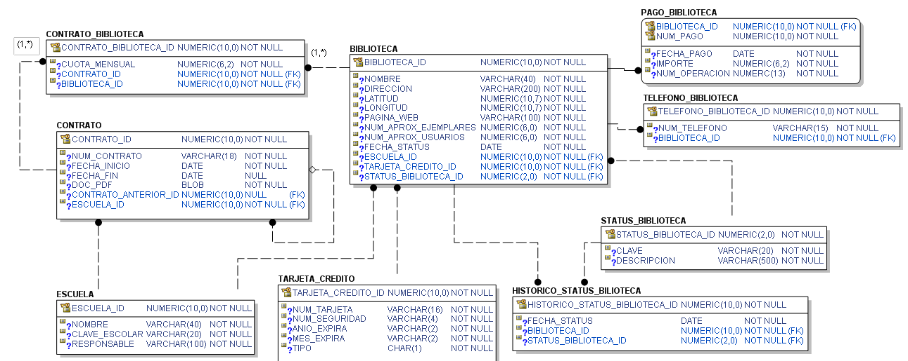

# schoolbook-contratos
Servicio encargado de realizar la administración de contratos que SchoolBook ofrece a las escuelas que se interesan en solicitar los servicios que SchoolBook ofrece para cada una de sus bibliotecas.

* La definición del caso de estudio completo se puede revisar en este [enlace](https://github.com/school-book/schoolbook-app)
### Entidades principales
* Contrato
* Escuela
* Biblioteca
* Status Biblioteca
* Pago Biblioteca
* Histórico status biblioteca
* Tarjeta de crédito.
### Modelo relacional

